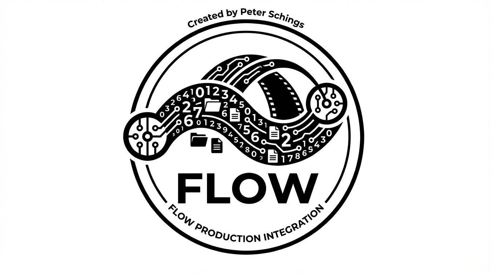

<div align="center">
  
  
  # VFX Flow for ComfyUI
  
  **Autodesk Flow (ShotGrid) Integration | Production Pipeline | Version Control**
</div>

---

Connect your ComfyUI workflows directly to Autodesk Flow (formerly ShotGrid). Browse projects, select shots, assign tasks, and publish versions—all from within ComfyUI.

## Installation

### Via ComfyUI Manager (Recommended)
1. Open ComfyUI Manager
2. Search for "VFX Flow"
3. Click Install
4. Restart ComfyUI

### Manual Installation
```bash
cd ComfyUI/custom_nodes
git clone https://github.com/beverlyhillscop90210/comfyui_vfx-flow
cd comfyui_vfx-flow
pip install -r requirements.txt
```

---

## Authentication

### User Login (Recommended) ✅

The simplest way to connect—use your own Flow/ShotGrid account:

1. Set `auth_method` to **user**
2. Enter your Flow **login** (email)
3. Enter your **password**

This is the recommended method for artists working interactively. Each user logs in with their own credentials, so permissions and tracking work correctly.

### Script API Key (For Automation)

For render farms, batch processing, or automated pipelines where no user is present:

1. Go to Admin → Scripts in Flow
2. Create new script: `comfyui_vfx_flow`
3. Copy the API key
4. Set `auth_method` to **script**
5. Enter `script_name` and `api_key`

Optionally set environment variables:
```bash
export FLOW_SITE_URL="https://your-studio.shotgrid.autodesk.com"
export FLOW_SCRIPT_NAME="comfyui_vfx_flow"
export FLOW_API_KEY="your_api_key_here"
```

---

## Nodes

### Flow Login

Establishes a connection to your Flow/ShotGrid instance. Supports both user-based and script-based authentication.

**Inputs:**
- `site_url` (STRING): Your Flow site URL (e.g., https://studio.shotgrid.autodesk.com)
- `auth_method` (COMBO): **user** (recommended) or **script**
- `login` (STRING): Your email (for user auth)
- `password` (STRING): Your password (for user auth)
- `script_name` (STRING): API script name (for script auth)
- `api_key` (STRING): API key (for script auth)

**Outputs:**
- `session` (FLOW_SESSION): Active connection for downstream nodes
- `status` (STRING): Connection status message

---

### Project Browser

Browse and select active projects from your Flow instance. Filters to show only active projects.

**Inputs:**
- `session` (FLOW_SESSION): Connection from Flow Login
- `project_name` (STRING): Filter by project name (partial match)

**Outputs:**
- `pipe` (FLOW_PIPE): Pipeline context with selected project
- `info` (STRING): Project details

---

### Shot Browser

Browse shots within the selected project. Optionally sets shot status to "In Progress" and retrieves the latest published version path.

**Inputs:**
- `pipe` (FLOW_PIPE): Pipeline context from Project Browser
- `shot_code` (STRING): Filter by shot code (partial match)
- `set_in_progress` (BOOLEAN): Automatically set shot status to "In Progress"

**Outputs:**
- `pipe` (FLOW_PIPE): Updated pipeline context with shot info
- `latest_version_path` (STRING): Path to the most recent published version
- `info` (STRING): Shot details

---

### Task Selector

Select a task on the current shot and optionally assign it to yourself.

**Inputs:**
- `pipe` (FLOW_PIPE): Pipeline context from Shot Browser
- `task_name` (STRING): Task name to select (e.g., "comp", "roto", "paint")
- `assign_to_me` (BOOLEAN): Assign the task to the current user

**Outputs:**
- `pipe` (FLOW_PIPE): Updated pipeline context with task and user info
- `info` (STRING): Task details

---

### Publish to Flow

Uploads a rendered file as a new version in Flow. Includes a safety toggle to prevent accidental publishes during workflow development.

**Inputs:**
- `pipe` (FLOW_PIPE): Pipeline context from Task Selector
- `file_path` (STRING): Path to the file to publish
- `description` (STRING): Version description/notes
- `do_publish` (BOOLEAN): **Safety toggle** - must be enabled to actually publish
- `status` (COMBO): Version status - Pending Review, Approved, etc.

**Outputs:**
- `version_id` (INT): ID of the created version (0 if not published)
- `info` (STRING): Publish result or skip message

---

### Filename from Pipe

Generates a consistent filename based on the current pipeline context. Ensures all saves follow studio naming conventions.

**Inputs:**
- `pipe` (FLOW_PIPE): Pipeline context
- `suffix` (STRING): Optional suffix (e.g., "_beauty", "_comp")

**Outputs:**
- `filename` (STRING): Generated filename (e.g., "ProjectX_SEQ01_SH010_comp_v003")
- `folder_suggestion` (STRING): Recommended output folder path
- `info` (STRING): Filename breakdown

---

## Custom Types

| Type | Description |
|------|-------------|
| FLOW_SESSION | Active connection to Flow/ShotGrid instance |
| FLOW_PIPE | Pipeline context carrying project, shot, task, and user data |

### The FLOW_PIPE Structure

All pipeline data flows through the `pipe`:

```python
{
    "session": <ShotGrid connection>,
    "project": {"id": 123, "name": "Project_X"},
    "shot": {"id": 456, "code": "SH010", "sequence": "SEQ01"},
    "task": {"id": 789, "name": "comp"},
    "user": {"id": 42, "name": "Peter Schings"},
    "version_number": 3,
    "resolved_filename": "ProjectX_SEQ01_SH010_comp_v003"
}
```

---

## Workflow Example

```
┌─────────────────────────────────────────────────────────────────────────────┐
│  VFX FLOW                           VFX BRIDGE                              │
├─────────────────────────────────────────────────────────────────────────────┤
│                                                                             │
│  Flow Login                                                                 │
│      ↓                                                                      │
│  Project Browser                                                            │
│      ↓ pipe                                                                 │
│  Shot Browser ─────────────────→ folder_path ──→ EXR Hot Folder Loader     │
│      ↓ pipe                                              ↓                  │
│  Task Selector                                      [Processing...]         │
│      ↓ pipe                                              ↓                  │
│  Filename from Pipe ───────────→ filename ───────→ EXR Save Node           │
│      │                          output_folder ─────────↗   ↓                │
│      ↓ pipe                                          saved_path             │
│  Publish to Flow ←─────────────────────────────────────────┘                │
│      ↓                                                                      │
│  [Version in ShotGrid] ✓                                                    │
│                                                                             │
└─────────────────────────────────────────────────────────────────────────────┘
```

---

## Integration with VFX Bridge

This package is designed to work seamlessly with [VFX Bridge](https://github.com/beverlyhillscop90210/comfyui_vfx-bridge).

### Load Shot → Process → Save → Publish

**Direct connections:**

| VFX Flow Output | → | VFX Bridge Input |
|-----------------|---|------------------|
| Shot Browser `folder_path` | → | EXR Hot Folder Loader `folder_path` |
| Filename from Pipe `filename` | → | EXR Save `filename` |
| Filename from Pipe `output_folder` | → | EXR Save `output_folder` |
| EXR Save `saved_path` | → | Publish to Flow `file_path` |

### Quick Setup

1. **Load**: Shot Browser's `folder_path` connects directly to EXR Hot Folder Loader
2. **Process**: Your ComfyUI workflow (denoise, upscale, color grade, etc.)
3. **Save**: Filename from Pipe outputs connect to EXR Save Node
4. **Publish**: EXR Save's `saved_path` connects to Publish to Flow

All naming is automatic based on your Flow context!

---

## Requirements

- ComfyUI 0.8+
- Python 3.10+
- shotgun_api3 >= 3.3.0

## Roadmap

- [x] Flow Login with user/script auth
- [x] Project Browser
- [x] Shot Browser with status updates
- [x] Task Selector with assignment
- [x] Publish to Flow with safety toggle
- [x] Filename from Pipe with output folder
- [x] Thumbnail upload
- [x] Add Note
- [x] Direct VFX Bridge integration
- [ ] Asset Browser
- [ ] Playlist creation
- [ ] Sequence Browser

## License

MIT License - see [LICENSE](LICENSE) for details.

---

<div align="center">
  <sub>Built for the VFX community by peterschings</sub>
</div>
